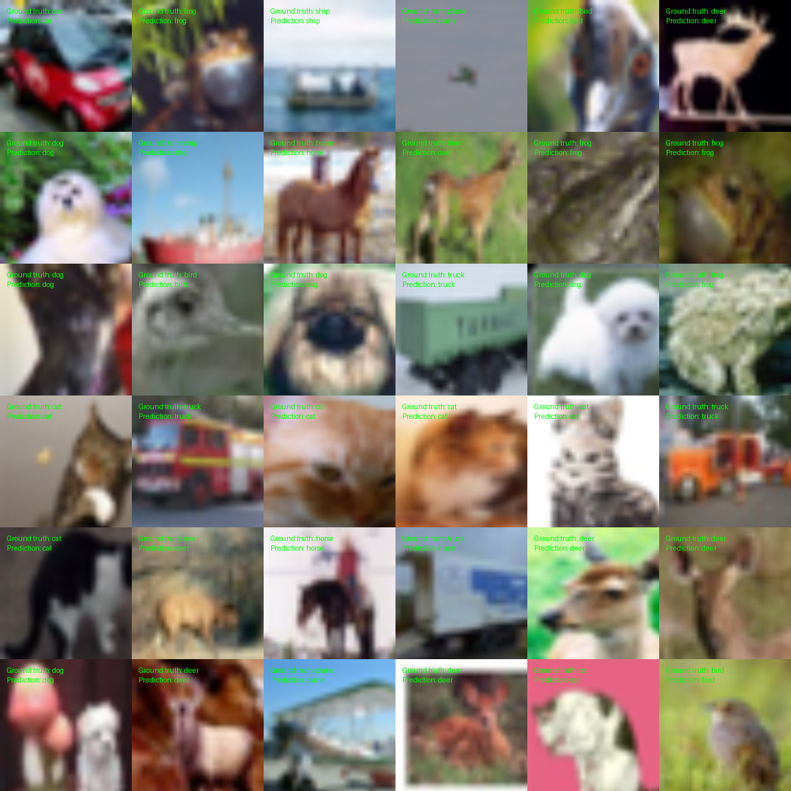

# PyTorch-based CIFAR-10 Classification using Vision Transformer and MixUp

This project is part of the coursework for **COMP0197: Applied Deep Learning** at University College London. The work is supervised by [Dr. Yipeng Hu](https://www.linkedin.com/in/huyipeng/).



## Project Overview

This project focuses on implementing and experimenting with MixUp, a data augmentation technique, using the PyTorch framework. The tasks are divided into different modes for easy execution and testing.

## Installation

To set up the environment for this project, follow these steps:

1. **Create a virtual environment and install the required packages:**
    ```bash
    conda create -n torch -c pytorch python=3.12 pytorch=2.2 torchvision=0.17
    ```

2. **Activate the virtual environment:**
    ```bash
    conda activate torch
    ```

## Technical Features

The training process involves the following key features:

- **Framework:** PyTorch
- **Dataset:** CIFAR-10
- **Model:** Custom CNN architecture based on Vision Transformer
- **Data Augmentation:** MixUp
- **Loss Function:** CrossEntropyLoss
- **Optimizer:** AdamW
- **Batch Size:** 256
- **Dropout:** 0.2
- **Learning Rate Scheduler:** Custom learning rate decay

## Additional Features

- **Transfer Learning:** The model is trained on top of ImageNet dataset pre-trained weights and is fine-tuned on CIFAR-10.
- **Layer freezing:** The initial layers of the model are frozen during training.
- **Demo:** A demo of the MixUp class is provided to understand the working of MixUp.
- **Logging:** The training process is logged using the `logging` module.

## Task Execution

The project can be executed in four different modes:

1. **Mode 0:** Run all the modes (default mode if none specified).
2. **Mode 1:** Execute Demo for MixUp Class.
3. **Mode 2:** Train the Model.
4. **Mode 3:** Test the model and visualize the results (Ensure to run Mode 2 or Mode 0 first, or download the weights into the `trained_models` directory from [here](https://liveuclac-my.sharepoint.com/:f:/g/personal/ucabs44_ucl_ac_uk/EkBqjhzkC-xIh9IoQiANhNEB19jyd2hiLXbB5u0w3uxw1w?e=LYZh6S)).

### Running the Modes

- To run a specific mode:
    ```bash
    python3 task.py --mode <mode_number>
    ```

- To run all modes:
    ```bash
    python3 task.py
    ```

## Directory Structure

Upon execution, the following directories will be created:

- **`trained_models`:** Contains the trained models. Download pre-trained model weights from [here](https://liveuclac-my.sharepoint.com/:f:/g/personal/ucabs44_ucl_ac_uk/EkBqjhzkC-xIh9IoQiANhNEB19jyd2hiLXbB5u0w3uxw1w?e=LYZh6S).
- **`mixup`:** Contains the demo output of the MixUp class.
- **`results`:** Contains the results of the model.
- **`data`:** The CIFAR-10 dataset will be downloaded to this folder.
- **`logs`:** Contains the logs of the execution. Logs from previous runs can be found here.

## Summary

The training process is summarized as follows:

- **EPOCHS:** 20
- **Loss Function:** CrossEntropyLoss
- **Optimizer:** AdamW
- **Batch Size:** 256
- **Dropout:** 0.2

## Training Summary

| Method | Training Loss | Validation Loss | Validation Accuracy | Validation Precision | Validation F1-score | Total Training Time(s) |
| --- | --- | --- | --- | --- | --- | --- |
| Sampling Method 1 | 0.6659 | 0.1197 | 97.06% | 1.0000 | 0.9990 | 2664.28 |
| Sampling Method 2 | 0.8321 | 0.1405 | 97.44% | 1.0000 | 1.0000 | 2668.08 |

## Testing Summary

| Method | Test Loss (CrossEntropy) | Validation Loss (CrossEntropy) | Test Accuracy | Validation Accuracy | Test Precision | Validation Precision | Test F1-score | Validation F1-score |
| --- |--------------------------|--------------------------------| --- | --- | --- | --- | --- | --- |
| Sampling Method 1 | 0.1060                   | 0.1197                         | 97.73% | 97.06% | 0.9980 | 1.0000 | 0.9980 | 0.9990 |
| Sampling Method 2 | 0.1369                   | 0.1405                         | 97.69% | 97.44% | 0.9990 | 1.0000 | 0.9985 | 1.0000 |

